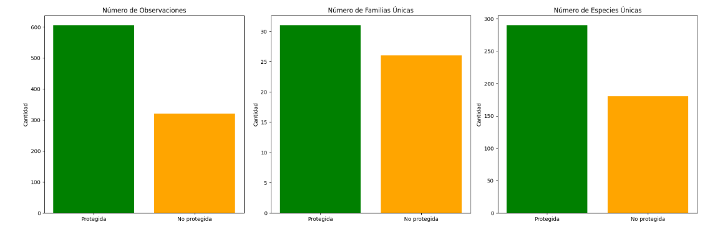
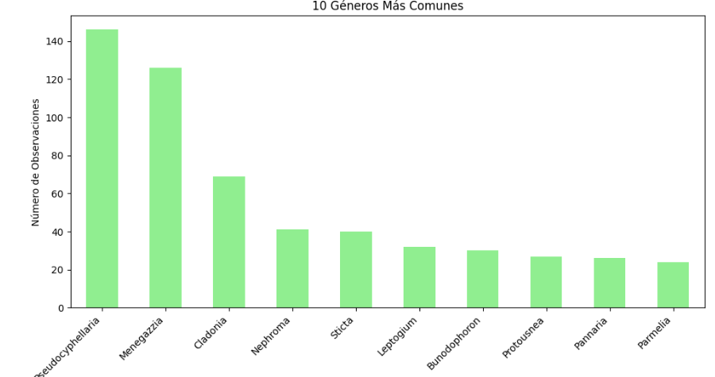

# 🍄 Diversidad de Macrohongos y Líquenes en la Región de Aysén 🍄
Readme de la investigación para el ramo "Metodologías de la Investigación" con título "Diversidad de Macrohongos y Líquenes en la Región de Aysén", por Javiera Catanzaro y Matilde Hernández.
---
## Introducción 
### Problemática
Pese a todas las importantes labores realizadas por el Reino Fungi, históricamente la ciencia lo ha olvidado dándole poca o cero importancias dentro de planes de conservación o tomas de decisiones al momento de intervenir ecosistemas. El conocimiento de las especies de Funga presente en los territorios y sus respectivos roles y asociaciones es esencial para el correcto manejo de estos, y para crear planes de conservación efectivos y duraderos, y por lo tanto es de crucial importancia protegerlos y conservarlos. 
### Hipótesis
La diversidad de especies de Macrohongos y Líquenes es significativamente mayor en áreas protegidas que en áreas no protegidas, debido a la menor perturbación antropogénica y la conservación de hábitats naturales.  
### Objetivos
El objetivo principal de este estudio es analizar los diversos tipos de macrohongos y líquenes presentes en la Región de Aysén y establecer una relación entre la Funga existente y las áreas protegidas de la zona. Específicamente, se busca identificar posibles vínculos entre la presencia de estas áreas y la cantidad de avistamientos registrados, así como la biodiversidad de las especies observadas.

## Base de datos📊
### Base de datos original
Inicialmente la base de datos fue tomada de la página web [💻GBIF Chile](https://gbif-chile.mma.gob.cl/ipt/resource?r=fungi_sib_aysen). Esta fue una investigación bibliográfica realizada por la Universida de Magallanes en el año 2019 que contiene 1263 registros del Reino Fungi en la región de Aysén.
Luego de una revisión a la base de datos, se le realizaron algunos cambios para hacer más fácil su uso durante la investigación.
### Cambios en la base de datos
- **Eliminación de datos que no serían utilizados:** La base de datos original contaba con columnas de datos que no serían utilizados para efectos de este trabajo, como autor de la bibliografía del registro, fecha del registro, etc. 

- **Eliminación de datos incompletos:** se identificaron y eliminaron aproximadamente 300 registros de avistamientos que carecían de una georreferenciación completa

- **Reordenamiento de las columnas para una mejor comprensión**

### Base de datos utilizada
Finalmente quedaron 926 datos, el archivo [📁Base_de_datos_Macrohongos_y_Liquenes_Region_de_Aysen.xlsx](Base_de_datos_Macrohongos_y_Liquenes_Region_de_Aysen.xlsx) contiene la base de datos que fue utilizada para la realización de este trabajo de investigación. 

## R Studio 
### Metodología
Se emplearon palabras clave para categorizar áreas protegidas, como "Parque Nacional", "Reserva Nacional", "Monumento Natural", entre otros. 
Se clasificaron los avistamientos según su ubicación, dividiéndolos en dos categorías: 
- Aquellos que ocurrieron dentro de Áreas Protegidas, a los que se les asignó el valor 1
- Aquellos que se registraron fuera de Áreas protegidas, a los que se les asignó el valor 0
### Código empleado
```r
---
title: "MAcro hongos"
author: "Javiera Catanzaro, Matilde Hernández"
date: "2025-06-22"
output: html_document
---

{r setup, include=FALSE}
knitr::opts_chunk$set(echo = TRUE)

{r cars}
library(readxl)
Macro_Hongos_Aysen_Metodología <- read_excel("C:/Users/HP/Downloads/Macro Hongos Aysen Metodología.xlsx", 
    col_types = c("numeric", "text", "text", 
        "text", "numeric", "numeric", "text", 
        "text", "text", "text", "text", "text", 
        "text", "text", "text", "text"))

bbdd = Macro_Hongos_Aysen_Metodología

localidades_unicas<-unique(bbdd$locality)
print("Localidades únicas en la base de datos:")
print(sort(localidades_unicas))

#Definir palabras clave para áreas protegidas.
palabras_clave_protegidas<- c("Parque Nacional", "Reserva Nacional", "Monumento Natural", "Queulat", "Río Simpson", "Lago Cochrane", "Coyhaique", "Laguna San Rafael", "Dos Lagunas")

#Crear columna binaria es_protegida
bbdd <- bbdd %>%mutate(es_protegida = ifelse(grepl(paste(palabras_clave_protegidas, collapse = "|"), locality, ignore.case = TRUE), 1,  0))

# Verificar la asignación: listar localidades y su estado de protección
asignacion_protegidas <- bbdd %>%distinct(locality, es_protegida) %>%arrange(es_protegida, locality)
print("Asignación de áreas protegidas:")
print(asignacion_protegidas)

# Resumen: cuántos registros y familias por estado de protección
resumen_protegidas <- bbdd %>%
  group_by(es_protegida) %>%
  summarise(
    n_registros = n(),
    n_familias = n_distinct(family),
    n_especies = n_distinct(genus)
  ) %>%
  mutate(tipo_area = ifelse(es_protegida == 1, "Protegida", "No protegida"))
print("Resumen por estado de protección:")
print(resumen_protegidas)
datos_localidad <- bbdd %>%
  group_by(locality, es_protegida) %>%
  summarise(n_avistamientos = n()) %>%
  ungroup()

#estos csv se usan en python, es mnuy importante correr R primero y despues python
write.csv(bbdd, "bbdd_con_es_protegida.csv", row.names = FALSE)


write.csv(asignacion_protegidas, "asignacion_areas_protegidas.csv", row.names = FALSE)
```

### Archivo resultante
El código realizado en R Studio entregó un archivo csv titulado "asignacion_areas_protegidas.csv", el cual fue utilizado para realizar el código en Python que entregó el análisis de los datos, con los gráficos que fueron utilizados en la presentación del presente trabajo. 

## Python 
### Código empleado
```python
import pandas as pd
import matplotlib.pyplot as plt

# Load the dataset
df = pd.read_csv("bbdd_con_es_protegida.csv")


n_obs_protected = df[df['es_protegida'] == 1].shape[0]
n_obs_non_protected = df[df['es_protegida'] == 0].shape[0]

families_protected = df[df['es_protegida'] == 1]['family'].nunique()
families_non_protected = df[df['es_protegida'] == 0]['family'].nunique()

species_protected = df[(df['es_protegida'] == 1) & (df['taxonRank'] == 'especie')][['genus', 'specificEpithet']].drop_duplicates().shape[0]
species_non_protected = df[(df['es_protegida'] == 0) & (df['taxonRank'] == 'especie')][['genus', 'specificEpithet']].drop_duplicates().shape[0]


fig, axs = plt.subplots(1, 3, figsize=(18, 6))

axs[0].bar(['Protegida', 'No protegida'], [n_obs_protected, n_obs_non_protected], color=['green', 'orange'])
axs[0].set_title('Número de Observaciones')
axs[0].set_ylabel('Cantidad')

axs[1].bar(['Protegida', 'No protegida'], [families_protected, families_non_protected], color=['green', 'orange'])
axs[1].set_title('Número de Familias Únicas')
axs[1].set_ylabel('Cantidad')

axs[2].bar(['Protegida', 'No protegida'], [species_protected, species_non_protected], color=['green', 'orange'])
axs[2].set_title('Número de Especies Únicas')
axs[2].set_ylabel('Cantidad')

plt.tight_layout()
plt.show()


total_observations = df.shape[0]
unique_localities = df['locality'].nunique()
unique_municipalities = df['municipality'].nunique()
unique_families = df['family'].nunique()
unique_genera = df['genus'].nunique()
unique_species = df[df['taxonRank'] == 'especie'][['genus', 'specificEpithet']].drop_duplicates().shape[0]

print("### Estadísticas Descriptivas")
print(f"Total de observaciones: {total_observations}")
print(f"Localidades únicas: {unique_localities}")
print(f"Municipios únicos: {unique_municipalities}")
print(f"Familias únicas: {unique_families}")
print(f"Géneros únicos: {unique_genera}")
print(f"Especies únicas: {unique_species}")

family_counts = df['family'].value_counts().head(10)
print("\n### 10 Familias Más Comunes")
print(family_counts)

plt.figure(figsize=(10, 6))
family_counts.plot(kind='bar', color='skyblue')
plt.title('10 Familias Más Comunes')
plt.xlabel('Familia')
plt.ylabel('Número de Observaciones')
plt.xticks(rotation=45, ha='right')
plt.tight_layout()
plt.show()

genus_counts = df['genus'].value_counts().head(10)

plt.figure(figsize=(10, 6))
genus_counts.plot(kind='bar', color='lightgreen')
plt.title('10 Géneros Más Comunes')
plt.xlabel('Género')
plt.ylabel('Número de Observaciones')
plt.xticks(rotation=45, ha='right')
plt.tight_layout()
plt.show()
```

### Resultados
El código empleado en Python entregó estadísticas y gráficos que fueron analizados para realizar las conclusiones de la nvestigación. 

**Número de observaciónes en áreas protegidas vs áreas no protegidas, y biodiversidad de familias y especies** 


---
**10 Familias más comunes dentro de los registros**


---
**10 Géneros más comunes dentro de los registros**



### Conclusiones principales.
- Gracias al análisis de datos y gráficas obtenidos durante el presente trabajo se aprueba la hipótesis planteada en un principio, “La diversidad de especies de macrohongos y líquenes es significativamente mayor en áreas protegidas que en áreas no protegidas, debido a la menor perturbación antropogénica y la conservación de hábitats naturales”. Se pudo evidenciar como cerca de un 64% de los registros fueron realizados específicamente en áreas protegidas de la región de Aysén.
- Aunque podrían existir sesgos dentro del estudio, se concluye que estos resultados se deben a la importancia de las áreas protegidas dentro del desarrollo de la vida del Reino Fungi, haciéndolas espacios de gran valor para la conservación de la biodiversidad, y convirtiendo a la Región de Aysén en un hotspot de Macrohongos y líquenes.
- El Reino Fungi es un pilar fundamental para la vida en la tierra, y su importancia es especialmente evidente en regiones como Aysén, donde las condiciones naturales favorecen su diversidad y abundancia.
- Continuar con el trabajo de investigación y conservación con enfoque en el Reino Fungi es imprescindible, ya que hoy en día no se puede hablar de sustentabilidad y conservación sin hablar de los maravillosos Hongos. 🍄
